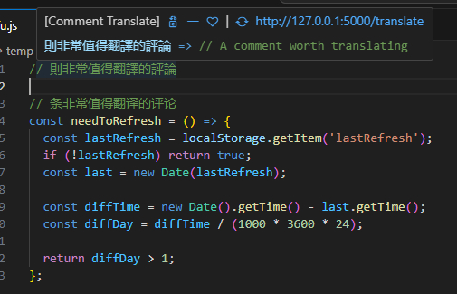
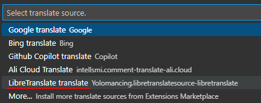

# libretranslate source


This plugin provides a translation source for the [comment-translate](https://github.com/intellism/vscode-comment-translate) vscode extension.
It relies on a local [LibreTranslate](https://github.com/LibreTranslate/LibreTranslate) install making the translation 100% free ;)




## Features

- Over comments to display translations in the info.
- Replace selection by translation
- Insert translation after selection

___Temporary limitation:___ *For now, the translation is locket from CN to EN. 'comment-translate' integration will be enhance shortly to detect source language and let you configure the targeted one.*

## Requirements

- [LibreTranslate](https://github.com/LibreTranslate/LibreTranslate): free and Open Source Machine Translation API, entirely self-hosted. Unlike other APIs, it doesn't rely on proprietary providers such as Google or Azure to perform translations. Instead, its translation engine is powered by the open source Argos Translate library.
- [comment-translate](https://github.com/intellism/vscode-comment-translate) vscode extension: this extension helps developers translate comments, strings, code hints, error messages, and variable names in their code.

## Install guide

1. Install [LibreTranslate](https://github.com/LibreTranslate/LibreTranslate) translation engine locally

First ensure [python](https://www.python.org/) and [pip](https://pip.pypa.io/en/stable/getting-started/) are working properly:
```
python --version
python -m pip --version
```

Install [LibreTranslate](https://github.com/LibreTranslate/LibreTranslate):
```
pip install libretranslate
```
> __Info:__ The languages installation can take few minutes

2. Run LibreTranslate
```
libretranslate
```
You can open a web browser to http://localhost:5000 an try the engine and use it directly.
The extension will target the local web API, see the [official doc](https://libretranslate.com/docs/)

3. Install [comment-translate](https://github.com/intellism/vscode-comment-translate) extension in vscode
4. Change `comment-translate` translation source by targeting `libretranslatesource`
In vscode execute:
```
> Change translation source
```
to invoke the service configuration page, select `libretranslate translate` source, and check the translation effect.




## Extension Settings
None for now.

However, please refer to the current configurations of the [comment-translate](https://github.com/intellism/vscode-comment-translate?tab=readme-ov-file#common-configurations) extension.


## Incoming features
- language detection and configuration
- configurable libretranslate's host url
- configurable text to translate max length
- prettify translations display

## Code references

- [deepl-translate](https://github.com/intellism/deepl-translate/): used as main source of inspiration
- [libretranslate-integration](https://github.com/Jararered/libretranslate-integration): for the context features